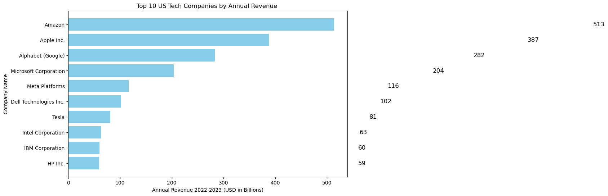
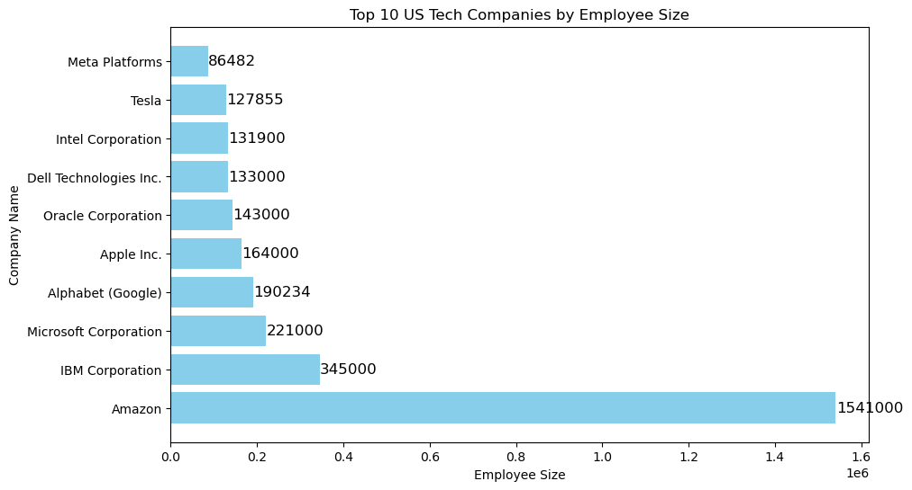
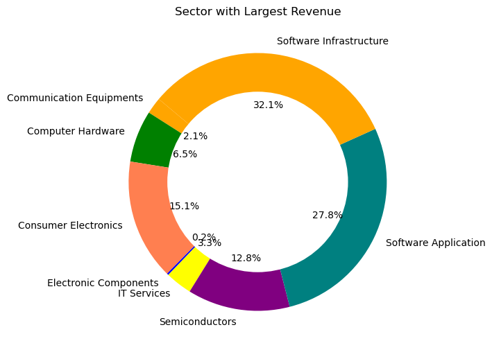
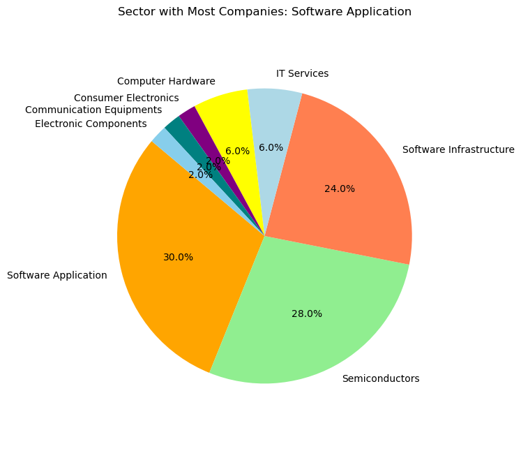

Certainly! Here's a README template for your data analysis project on the top 50 US tech companies using bar plots, donut charts, and pie charts:

---

# Data Analysis of Top 50 US Tech Companies

This project performs data analysis on the top 50 US tech companies using various visualization techniques, including bar plots, donut charts, and pie charts, to gain insights into key aspects of these companies.

## Table of Contents

- [Prerequisites](#prerequisites)
- [Usage](#usage)
- [Visualizations](#visualizations)
- [Data Sources](#data-sources)
- [License](#license)

## Prerequisites

Before running the code for data analysis, make sure you have the following dependencies installed:

- Python (>=3.6)
- Pandas
- Matplotlib

You can install the required Python packages using pip:

```
pip install pandas matplotlib
```

## Usage

1. Clone or download this repository to your local machine.

2. Prepare your dataset in CSV format with information about the top 50 US tech companies, including columns like 'Company Name,' 'Annual Revenue,' 'Employee Size,' 'Sector,' 'State,' and 'Market Cap.'

3. Replace the sample dataset (`US_TECH_COMPANIES.csv`) in the code with your dataset.

4. Run the Python script to generate visualizations.

## Visualizations

### 1. Bar Plot for Revenue Comparison

The script creates a bar plot to compare the annual revenue of the top 10 US tech companies. It identifies the companies with the highest revenue.


### 2. Bar Plot for Employee Size Comparison

The script creates a bar plot to compare the employee size of the top 10 US tech companies. It identifies the companies with the highest employee.



### 3. Donut Chart for Market Cap Composition

A donut chart visualizes the composition of market capitalization categories (e.g., large-cap, mid-cap, small-cap) among the top 50 US tech companies.



### 4. Pie Chart for Sector Distribution

A pie chart represents the distribution of companies across different sectors within the top 50 US tech companies.



## Data Sources

The data used for this analysis is sourced from kaggle. Please ensure you have the necessary permissions to use and analyze this data.

## License

This project is licensed under the MIT License 
---

